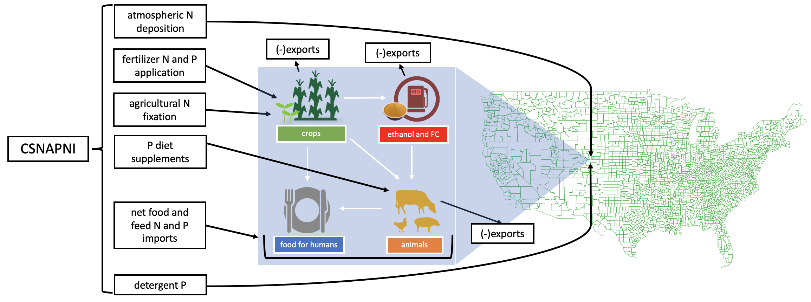

```{r setup, include=FALSE}
knitr::opts_chunk$set(echo = TRUE)
```
***
<center>

</center>
<br>

The CSNAPNI model is designed to estimate nutrient inputs (real and embodied) to specific products, including crops, corn ethanol, and animal products, in addition to total nutrient inputs at the county and watershed scale for the conterminous United States (US). 

The model is a combination of the [Net Anthropogenic Nitrogen Inputs (NANI) and Net Anthropogenic Phosphorus Inputs (NAPI) Toolboxes](http://www.eeb.cornell.edu/biogeo/nanc/nani/nani.htm), with added "commodity-specific" functionalities.

The model includes crop and animal production data for 3111 counties (or statistical equivalents) in the conterminous United States. Datasets correspond to agricultural census years 1997-2017.

## Model Tutorial (add TOC and internal links to headings)

* [Settings](#settings)
* [Create Inputs](#createinputs)
* [Load data](#load)
* [Recoverable manure](#manure)
* [Translate county-level data into watershed-level data](#cnty-ws)
* [Human N and P requirements](#hmnNP)
* [Crop production](#cropprod)
* [Meat production](#meatprod)
* [Food production totals](#foodprod)
* [Crop and ethanol fertilizer and fixation](#Cfertfix)
* [Meat impacts](#Mimpacts)
* [Impacts per nutritional units](#pernutrition)

### Settings {#settings}
Use `Config/Settings.R` to specify:

* whether new input files should be generated from the original data sources (this should not be necessary unless this is the first time you are running the model, or the raw data sources have been updated since the last time input files were generated)
* which allocation method to use for ethanol and ethanol coproducts
* which meat protein content assumptions to use (Costello's or DeVries')
* which data years should be included in model outputs

The default settings are shown in the output below.
```{r include = TRUE}
source("Config/Settings.R")
```

### Create Inputs {#createinputs}
`ModelSubs/CreateInputs.R` generates the input files needed to run CSNAPNI. As stated above, this should only be necessary unless this is the first time you are running the model, or the raw data sources have been updated since the last time input files were generated.
```{r include = TRUE}
if(get_new_data==1){
  source("ModelSubs/CreateInputs.R")
}
```

### Load Data {#load}
`ModelSubs/LoadData.R` is the program responsible for loading the data from the `InputFiles` folder into the R environment.
```{r include = TRUE}
source("ModelSubs/LoadData.R")
```

### Recoverable manure {#manure}
`ModelSubs/manure.R` uses the average annual populations of animals, calculated from agricultural census data, and corresponding confinement and manure recoverability factors from Kellogg et al. (2000) **Table 3** to estimate the amount of recoverable manure produced in each county. This method assumes that all manure is from confinement facilities.
```{r include = TRUE}
#Calculate recoverable manure for counties and 450 watersheds
source("ModelSubs/manure.R")
```

### Translate county-level data into watershed-level data {#cnty-ws}
`ModelSubs/NEEAshedsdyn.R` first determines intersections of county-level data with 450 watersheds in the conterminous US. Then it sorts crop, animal, and manure production, NANI and NAPI data, human populations, and areas into watersheds corresponding to National Estuarine Eutrophication Assessment (NEEA) watersheds (Sources: *Bricker, SB, JG Ferreira and T Simas. 2003. An integrated methodology for assessment of estuarine trophic status. Ecological Modeling. 169:39-60.* and http://ian.umces.edu/neea/).
```{r include = TRUE}
#Determine intersections of county-level data with 450 watersheds in the conterminous US
#Sort watershed-level crop, animal, manure production, NANI and NAPI toolbox, human population, and area datasets 
#into 144 NEEA watersheds
source("ModelSubs/NEEAshedsdyn.R")
```

### Human N and P requirements {#hmnNP}
`ModelSubs/hmn_reqs.R` uses data from the [USDA ERS Food Availability Data System](https://www.ers.usda.gov/data-products/food-availability-per-capita-data-system/) and human population data to estimate the availability of food nutrients for people at the NEEA watershed-level.
  *What's the bit about total animals ws? Why is that in there and not in NEEAshedsdyn?*
```{r include = TRUE}
source("ModelSubs/hmn_reqs.R")
```

### Crop production {#cropprod}
`ModelSubs/CropProd.R` calculates various crop production and export vectors.
```{r include = TRUE}
source("ModelSubs/CropProd.R")
```

### Meat production {#meatprod}
`ModelSubs/MeatProd.R` uses the average annual populations and meat production of 19 animal types to estimate the production quantities of edible beef, pork, milk, eggs, chicken, and turkey products. 
```{r include = TRUE}
source("ModelSubs/meat_alloc.R") #creates kgmeat
```

### Food production totals {#foodprod}
`ModelSubs/food_totals.R` 
```{r include = TRUE}
source("ModelSubs/food_totals.R")
```

### Crop and ethanol fertilizer and fixation {#Cfertfix}
`ModelSubs/Cprodfertfix.R` 
```{r include = TRUE}
## CROP, ETHANOL, and COPRODUCT FERTILIZER AND FIXATION
source("ModelSubs/Cprodfertfix.R")
```

### Meat impacts {#Mimpacts}
`ModelSubs/Mprodimpacts.R`
```{r include = TRUE}
source("ModelSubs/Mprodimpacts.R")
```

### Impacts per nutritional units {#pernutrition}
`ModelSubs/pernutrition.R`
```{r include = TRUE}
source("ModelSubs/pernutrition.R")
```


```{r}
#source("CSNAPNIv1.R")
```


```{r include = FALSE}
source("FigureSubs/fig_setup.r") #year_labels will need to be changed if there is a change in the years offered
```

<!-- ## Results -->
<!-- ### 1. NANI -->
<!-- ```{r NANItotals_plot,echo=FALSE,fig.width=15,fig.height=8,fig.cap="\\label{fig:Rn`}***Figure 1.1: Net Anthropogenic Nitrogen Input (NANI) totals for the US.** Results shown are from the commodity-specific NANI (CSNANI) (a) and the Visual Basic NANI Toolbox (b). One of the clearest differences between the two models is fertilizer for food input estimations. CSNANI estimates these using crop-specific national average fertilizer application rates for 16 commodity food crops, and the VB NANI uses USGS fertilizer sales data.*"} -->
<!-- positives1 <- negatives1 <- NANIBtot_US -->
<!-- positives1[positives1<0] <- 0 -->
<!-- negatives1[negatives1>0] <- 0 -->
<!-- positives2 <- negatives2 <- NANIorigtot_US -->
<!-- positives2[positives2<0] <- 0 -->
<!-- negatives2[negatives2>0] <- 0 -->
<!-- myrange <- c(min(c(colSums(negatives1),colSums(negatives2)))-1,max(c(colSums(positives1),colSums(positives2)))+1) -->

<!-- par(mai=c(1, 3.6, 1, 0.4), xpd=TRUE, mfrow=c(1,2)) -->
<!-- barplot(positives1, -->
<!--         main="a) CSNANI",  -->
<!--         ylab="N (10^9 kg)",  -->
<!--         col=NANI_colors, -->
<!--         axes=FALSE, -->
<!--         names.arg = year_labels, -->
<!--         cex.lab=1.5, cex.axis=1.5, cex.main=1.5, -->
<!--         ylim=myrange, bty='L', width = 1, space = 0.5) -->
<!-- barplot(negatives1,add=TRUE,ylim=rev(myrange),col=NANI_colors, width = 1, space = 0.5) -->
<!-- axis(2) -->
<!-- box() -->
<!-- legend("topright", inset=c(1.3,0), legend=c("atmospheric deposition","biological fixation","fertilizer for food","net food and feed imports","non-ag fertilizer","non-food fertilizer"), fill=NANI_colors) -->

<!-- par(mai=c(1, 1, 1, 3), xpd=TRUE) -->
<!-- myrange <- c(min(c(colSums(negatives1),colSums(negatives2)))-1,max(c(colSums(positives1),colSums(positives2)))+1) -->
<!-- barplot(positives2, -->
<!--         main="b) VB NANI Toolbox",  -->
<!--         ylab="N (10^9 kg)",  -->
<!--         col=NANI_colors, -->
<!--         axes=FALSE, -->
<!--         names.arg = year_labels, -->
<!--         cex.lab=1.5, cex.axis=1.5, cex.main=1.5, -->
<!--         ylim=myrange, bty='L', width = 1, space = 0.5) -->
<!-- barplot(negatives2,add=TRUE,ylim=rev(myrange),col=NANI_colors, width = 1, space = 0.5) -->
<!-- axis(2) -->
<!-- box() -->
<!-- ``` -->
<!-- <br> -->
<!-- <br> -->
<!-- <br> -->
<!-- ```{r NANI_wsspec_plot,echo=FALSE,fig.width=11,fig.height=8,fig.cap="\\label{fig:Rn`}***Figure 1.2: Watershed specific NANI totals** Using new NANI.*"} -->
<!-- for(n in 1:nyrs){ -->
<!--   NANI_wsspec[,n] = colSums(NANIBtot[ws,,n])/(10^9) -->
<!-- } -->
<!-- positives <- negatives <- NANI_wsspec -->
<!-- positives[positives<0] <- 0 -->
<!-- negatives[negatives>0] <- 0 -->
<!-- myrange <- c(min(colSums(negatives))-1,max(colSums(positives))+1) -->
<!-- par(mai=c(1, 1, 1, 4), xpd=TRUE) -->
<!-- barplot(positives, -->
<!--       main="NANI for selected watersheds",  -->
<!--       ylab="N (10^9 kg)",  -->
<!--       col=NANI_colors, -->
<!--       axes=FALSE, -->
<!--       names.arg = year_labels, -->
<!--       cex.lab=1.5, cex.axis=1.5, cex.main=1.5, -->
<!--       ylim=myrange, bty='L', width = 1, space = 0.5) -->
<!-- barplot(negatives,add=TRUE,ylim=rev(myrange),col=NANI_colors, width = 1, space = 0.5) -->
<!-- axis(2) -->
<!-- box() -->
<!-- legend("topright", inset=c(-0.42,0), legend=c("atmospheric deposition","biological fixation","agricultural fertilizer","net food and feed imports","domestic fertilizer","non-food fertilizer"), fill=NANI_colors) -->
<!-- ``` -->
<!-- <br> -->
<!-- <br> -->
<!-- <br> -->
<!-- ```{r fertandfixN_plot,echo=FALSE,fig.width=15,fig.height=8,fig.cap="\\label{fig:Rn`}***Figure 1.3: Total commodity-disaggregated fertilizer (a) and fixation (b) inputs for selected watersheds.***"} -->
<!-- par(mai=c(1, 3.6, 1, 0.4), xpd=TRUE,mfrow=c(1,2)) -->
<!-- barplot(t(total_commoddisag_fertN), -->
<!--         main="a) fertilizer N",  -->
<!--         ylab="N (10^9 kg)",  -->
<!--         col=crop_colors, -->
<!--         axes=FALSE, -->
<!--         names.arg = year_labels, -->
<!--         cex.lab=1.5, cex.axis=2, cex.main=2, cex.names = 1, -->
<!--         ylim=c(0,9), bty='L', width = 1, space = 0.5) -->
<!-- axis(2,cex.axis=1.5) -->
<!-- box() -->
<!-- legend("topright", inset=c(1.4,0), legend=c(crop_labels,"ethanol"),  fill=crop_colors) -->

<!-- par(mai=c(1, 1, 1, 3), xpd=TRUE) -->
<!-- barplot(total_commoddisag_fixN, -->
<!--         main="b) fixation N",  -->
<!--         ylab="N (10^9 kg)",  -->
<!--         col=crop_colors, -->
<!--         axes=FALSE, -->
<!--         names.arg = year_labels, -->
<!--         cex.lab=1.5, cex.axis=2, cex.main=2, cex.names = 1, -->
<!--         ylim=c(0,9), bty='L', width = 1, space = 0.5) -->
<!-- axis(2,cex.axis=1.5) -->
<!-- box() -->
<!-- ``` -->
<!-- <br> -->
<!-- <br> -->
<!-- <br> -->
<!-- ```{r etohNperL_plot,echo=FALSE,fig.width=11,fig.height=8,fig.cap="\\label{fig:Rn`}***Figure 1.4: Fertilizer N inputs per liter of ethanol fuel from 1987-2012.** This estimate excludes N inputs allocated to ethanol coproducts. Decreasing N inputs per liter from 1997-2007 are driven by improved corn to ethanol conversion efficiency and reduced N inputs per mass of corn. The increase in 2012 resulted from drought conditions and reduced corn yield.*"} -->
<!-- par(mai=c(1, 1, 1, 1), xpd=TRUE) -->
<!-- barplot(unitfertNetoh*10^3, -->
<!--         main="Fertilizer N inputs per liter of ethanol fuel",  -->
<!--         ylab="g N / L ethanol",  -->
<!--         col=crop_colors[20], -->
<!--         axes=FALSE, -->
<!--         names.arg = year_labels, -->
<!--         cex.lab=1.5, cex.axis=1.5, cex.main=1.5, -->
<!--         ylim=c(0,40), bty='L', width = 1, space = 0.5) -->
<!-- axis(2) -->
<!-- box() -->
<!-- ``` -->
<!-- ```{r echo=FALSE, results = 'asis'} -->
<!-- library(knitr) -->
<!-- unitfertNetoh_df = data.frame(unitfertNetoh*10^3) -->
<!-- rownames(unitfertNetoh_df) = year_labels -->
<!-- kable(unitfertNetoh_df, caption = "Figure 1.4: Fertilizer N inputs per liter of ethanol fuel from 1987-2012. This estimate excludes N inputs allocated to ethanol coproducts. Decreasing N inputs per liter from 1997-2007 are driven by improved corn to ethanol conversion efficiency and reduced N inputs per mass of corn. The increase in 2012 resulted from drought conditions and reduced corn yield.") -->
<!-- ``` -->
<!-- <br> -->
<!-- <br> -->
<!-- <br> -->
<!-- ```{r meatNperprot_plot,echo=FALSE,fig.width=20,fig.height=15,fig.cap="\\label{fig:Rn`}**Figure 1.5: Fertilizer and Fixation N inputs to animal feeds per kg protein in animal food products from 1997-2012.** Other grains are CGF, CGM, wheat, barley, sorghum, and rye. CGF, CGM, and DGS stand for corn gluten feed, corn gluten meal, and distiller’s grains and solubles, respectively."} -->
<!-- year_range = 1:5 -->
<!-- par(mai=c(0.5, 4, 0.5, 0.25), xpd=TRUE, mfrow=c(3,2)) -->
<!-- meat_type=1 #beef -->
<!-- major_feeds_for_beef=c(10:11,13:14,12,1:2,19) #reordered to keep grains and forage together -->
<!-- minor_feeds_for_beef=c(3:9,15:18) -->
<!-- Nimpacts_major_feeds=fertNperMprot[meat_type,major_feeds_for_beef,year_range]+fixNperMprot[meat_type,major_feeds_for_beef,year_range] -->
<!-- Nimpacts_minor_feeds=colSums(fertNperMprot[meat_type,minor_feeds_for_beef,year_range])+colSums(fixNperMprot[meat_type,minor_feeds_for_beef,year_range]) #this combines the minor feeds into a single category -->
<!-- barplot(rbind(Nimpacts_major_feeds,Nimpacts_minor_feeds), #N requirements of meat products over time -->
<!--         main="a) beef",  -->
<!--         ylab="kg N input / kg protein",  -->
<!--         col=c(crop_colors[major_feeds_for_beef],"white"), -->
<!--         axes=FALSE, -->
<!--         names.arg = year_labels, -->
<!--         cex.lab=2, cex.axis=3, cex.main=3, cex.names = 2, -->
<!--         ylim=c(0,1.8), bty='L', width = 1, space = 0.5) -->
<!-- axis(2,cex.axis=1.5) -->
<!-- box() -->
<!-- legend(cex=2.1,"topright", inset=c(1.18,0), legend=c(crop_labels[major_feeds_for_beef],"other grains"),  fill=c(crop_colors[major_feeds_for_beef],"white")) -->
<!-- #Other grains = CGF, CGM, Wheat, Barley, Sorghum, Rye -->

<!-- par(mai=c(0.5, 0.75, 0.5, 3.6)) -->
<!-- meat_type=3 #pork -->
<!-- major_feeds_for_beef=c(10:11,13:14,12,1:2,19) #reordered to keep grains and forage together -->
<!-- minor_feeds_for_beef=c(3:9,15:18) -->
<!-- Nimpacts_major_feeds=fertNperMprot[meat_type,major_feeds_for_beef,year_range]+fixNperMprot[meat_type,major_feeds_for_beef,year_range] -->
<!-- Nimpacts_minor_feeds=colSums(fertNperMprot[meat_type,minor_feeds_for_beef,year_range])+colSums(fixNperMprot[meat_type,minor_feeds_for_beef,year_range]) #this combines the minor feeds into a single category -->
<!-- barplot(rbind(Nimpacts_major_feeds,Nimpacts_minor_feeds), #N requirements of meat products over time -->
<!--         main="b) pork",  -->
<!--         ylab="kg N input / kg protein",  -->
<!--         col=c(crop_colors[major_feeds_for_beef],"white"), -->
<!--         axes=FALSE, -->
<!--         names.arg = year_labels, -->
<!--         cex.lab=2, cex.axis=3, cex.main=3, cex.names = 2, -->
<!--         ylim=c(0,1.8), bty='L', width = 1, space = 0.5) -->
<!-- axis(2,cex.axis=1.5) -->
<!-- box() -->

<!-- par(mai=c(0.5, 4, 0.5, 0.25)) -->
<!-- meat_type=2 #milk -->
<!-- major_feeds_for_beef=c(10:11,13:14,12,1:2,19) #reordered to keep grains and forage together -->
<!-- minor_feeds_for_beef=c(3:9,15:18) -->
<!-- Nimpacts_major_feeds=fertNperMprot[meat_type,major_feeds_for_beef,year_range]+fixNperMprot[meat_type,major_feeds_for_beef,year_range] -->
<!-- Nimpacts_minor_feeds=colSums(fertNperMprot[meat_type,minor_feeds_for_beef,year_range])+colSums(fixNperMprot[meat_type,minor_feeds_for_beef,year_range]) #this combines the minor feeds into a single category -->
<!-- barplot(rbind(Nimpacts_major_feeds,Nimpacts_minor_feeds), #N requirements of meat products over time -->
<!--         main="c) milk",  -->
<!--         ylab="kg N input / kg protein",  -->
<!--         col=c(crop_colors[major_feeds_for_beef],"white"), -->
<!--         axes=FALSE, -->
<!--         names.arg = year_labels, -->
<!--         cex.lab=2, cex.axis=3, cex.main=3, cex.names = 2, -->
<!--         ylim=c(0,1.8), bty='L', width = 1, space = 0.5) -->
<!-- axis(2,cex.axis=1.5) -->
<!-- box() -->

<!-- par(mai=c(0.5, 0.75, 0.5, 3.6)) -->
<!-- meat_type=6 #eggs -->
<!-- major_feeds_for_beef=c(10:11,13:14,12,1:2,19) #reordered to keep grains and forage together -->
<!-- minor_feeds_for_beef=c(3:9,15:18) -->
<!-- Nimpacts_major_feeds=fertNperMprot[meat_type,major_feeds_for_beef,year_range]+fixNperMprot[meat_type,major_feeds_for_beef,year_range] -->
<!-- Nimpacts_minor_feeds=colSums(fertNperMprot[meat_type,minor_feeds_for_beef,year_range])+colSums(fixNperMprot[meat_type,minor_feeds_for_beef,year_range]) #this combines the minor feeds into a single category -->
<!-- barplot(rbind(Nimpacts_major_feeds,Nimpacts_minor_feeds), #N requirements of meat products over time -->
<!--         main="d) eggs",  -->
<!--         ylab="kg N input / kg protein",  -->
<!--         col=c(crop_colors[major_feeds_for_beef],"white"), -->
<!--         axes=FALSE, -->
<!--         names.arg = year_labels, -->
<!--         cex.lab=2, cex.axis=3, cex.main=3, cex.names = 2, -->
<!--         ylim=c(0,1.8), bty='L', width = 1, space = 0.5) -->
<!-- axis(2,cex.axis=1.5) -->
<!-- box() -->

<!-- par(mai=c(0.5, 4, 0.5, 0.25)) -->
<!-- meat_type=7 #chicken -->
<!-- major_feeds_for_beef=c(10:11,13:14,12,1:2,19) #reordered to keep grains and forage together -->
<!-- minor_feeds_for_beef=c(3:9,15:18) -->
<!-- Nimpacts_major_feeds=fertNperMprot[meat_type,major_feeds_for_beef,year_range]+fixNperMprot[meat_type,major_feeds_for_beef,year_range] -->
<!-- Nimpacts_minor_feeds=colSums(fertNperMprot[meat_type,minor_feeds_for_beef,year_range])+colSums(fixNperMprot[meat_type,minor_feeds_for_beef,year_range]) #this combines the minor feeds into a single category -->
<!-- barplot(rbind(Nimpacts_major_feeds,Nimpacts_minor_feeds), #N requirements of meat products over time -->
<!--         main="e) chicken",  -->
<!--         ylab="kg N input / kg protein",  -->
<!--         col=c(crop_colors[major_feeds_for_beef],"white"), -->
<!--         axes=FALSE, -->
<!--         names.arg = year_labels, -->
<!--         cex.lab=2, cex.axis=3, cex.main=3, cex.names = 2, -->
<!--         ylim=c(0,1.8), bty='L', width = 1, space = 0.5) -->
<!-- axis(2,cex.axis=1.5) -->
<!-- box() -->

<!-- par(mai=c(0.5, 0.75, 0.5, 3.6)) -->
<!-- meat_type=8 #turkey -->
<!-- major_feeds_for_beef=c(10:11,13:14,12,1:2,19) #reordered to keep grains and forage together -->
<!-- minor_feeds_for_beef=c(3:9,15:18) -->
<!-- Nimpacts_major_feeds=fertNperMprot[meat_type,major_feeds_for_beef,year_range]+fixNperMprot[meat_type,major_feeds_for_beef,year_range] -->
<!-- Nimpacts_minor_feeds=colSums(fertNperMprot[meat_type,minor_feeds_for_beef,year_range])+colSums(fixNperMprot[meat_type,minor_feeds_for_beef,year_range]) #this combines the minor feeds into a single category -->
<!-- barplot(rbind(Nimpacts_major_feeds,Nimpacts_minor_feeds), #N requirements of meat products over time -->
<!--         main="f) turkey",  -->
<!--         ylab="kg N input / kg protein",  -->
<!--         col=c(crop_colors[major_feeds_for_beef],"white"), -->
<!--         axes=FALSE, -->
<!--         names.arg = year_labels, -->
<!--         cex.lab=2, cex.axis=3, cex.main=3, cex.names = 2, -->
<!--         ylim=c(0,1.8), bty='L', width = 1, space = 0.5) -->
<!-- axis(2,cex.axis=1.5) -->
<!-- box() -->
<!-- ``` -->
<!-- <br> -->
<!-- <br> -->
<!-- <br> -->

<!-- ### 2. NAPI -->
<!-- ```{r NAPItotals_plot,echo=FALSE,fig.width=15,fig.height=8,fig.cap="\\label{fig:Rn`}***Figure 2.1: Net Anthropogenic Phosphorus Input (NAPI) totals for the US.** Results shown are from the commodity-specific NAPI (CSNAPI) (a) and the Visual Basic NAPI Toolbox (b). One of the clearest differences between the two models is fertilizer for food input estimations. CSNAPI estimates these using crop-specific national average fertilizer application rates for 16 commodity food crops, and the VB NAPI uses USGS fertilizer sales data.*"} -->
<!-- positives1 <- negatives1 <- NAPIBtot_US -->
<!-- positives1[positives1<0] <- 0 -->
<!-- negatives1[negatives1>0] <- 0 -->
<!-- positives2 <- negatives2 <- NAPIorigtot_US -->
<!-- positives2[positives2<0] <- 0 -->
<!-- negatives2[negatives2>0] <- 0 -->
<!-- myrange <- c(min(c(colSums(negatives1),colSums(negatives2))),max(c(colSums(positives1),colSums(positives2)))+0.5) -->

<!-- par(mai=c(1, 3.6, 1, 0.4), xpd=TRUE, mfrow=c(1,2)) -->
<!-- barplot(positives1, -->
<!--         main="a) CSNAPI",  -->
<!--         ylab="P (10^9 kg)",  -->
<!--         col=NAPI_colors, -->
<!--         axes=FALSE, -->
<!--         names.arg = year_labels, -->
<!--         cex.lab=1.5, cex.axis=1.5, cex.main=1.5, -->
<!--         ylim=myrange, bty='L', width = 1, space = 0.5) -->
<!-- barplot(negatives1,add=TRUE,ylim=rev(myrange),col=NAPI_colors, width = 1, space = 0.5) -->
<!-- axis(2) -->
<!-- box() -->
<!-- legend("topright", inset=c(1.3,0), legend=c("fertilizer for food","net food and feed imports","non-ag fertilizer","non-food fertilizer","detergent","animal diet supplements"),  fill=NAPI_colors) -->

<!-- par(mai=c(1, 1, 1, 3), xpd=TRUE) -->
<!-- barplot(positives2, -->
<!--         main="VB NAPI Toolbox",  -->
<!--         ylab="P (10^9 kg)",  -->
<!--         col=NAPI_colors, -->
<!--         axes=FALSE, -->
<!--         names.arg = year_labels, -->
<!--         cex.lab=1.5, cex.axis=1.5, cex.main=1.5, -->
<!--         ylim=myrange, bty='L', width = 1, space = 0.5) -->
<!-- barplot(negatives2,add=TRUE,ylim=rev(myrange),col=NAPI_colors, width = 1, space = 0.5) -->
<!-- axis(2) -->
<!-- box() -->
<!-- ``` -->
<!-- <br> -->
<!-- <br> -->
<!-- <br> -->
<!-- ```{r fertP_plot,echo=FALSE,fig.width=11,fig.height=8,fig.cap="\\label{fig:Rn`}***Figure 2.2: Total commodity-disagreggated fertilizer inputs for selected watersheds.***"} -->
<!-- par(mai=c(1, 1, 1, 4), xpd=TRUE) -->
<!-- barplot(t(total_commoddisag_fertP), -->
<!--         main="Fertilizer P: Total commodity-disaggregated inputs",  -->
<!--         ylab="P (10^9 kg)",  -->
<!--         col=crop_colors, -->
<!--         axes=FALSE, -->
<!--         names.arg = year_labels, -->
<!--         cex.lab=1.5, cex.axis=1.5, cex.main=1.5, -->
<!--         ylim=c(0,2), bty='L', width = 1, space = 0.5) -->
<!-- axis(2) -->
<!-- box() -->
<!-- legend("topright", inset=c(-0.37,0), legend=c(crop_labels,"Ethanol"),  fill=crop_colors) -->
<!-- ``` -->
<!-- <br> -->
<!-- <br> -->
<!-- <br> -->
<!-- ```{r etohPperL_plot,echo=FALSE,fig.width=11,fig.height=8,fig.cap="\\label{fig:Rn`}***Figure 2.3: Fertilizer P inputs per liter of ethanol fuel from 1987-2012.** This estimate excludes P inputs allocated to ethanol coproducts.*"} -->
<!-- par(mai=c(1, 1, 1, 1), xpd=TRUE) -->
<!-- barplot(unitfertPetoh*10^3, -->
<!--         main="Fertilizer P inputs per liter of ethanol fuel",  -->
<!--         ylab="g P / L ethanol",  -->
<!--         col=crop_colors[20], -->
<!--         axes=FALSE, -->
<!--         names.arg = year_labels, -->
<!--         cex.lab=1.5, cex.axis=1.5, cex.main=1.5, -->
<!--         ylim=c(0,7), bty='L', width = 1, space = 0.5) -->
<!-- axis(2) -->
<!-- box() -->
<!-- ``` -->
<!-- <br> -->
<!-- <br> -->
<!-- <br> -->
<!-- ```{r meatPperprot_plot,echo=FALSE,fig.width=20,fig.height=20,fig.cap="\\label{fig:Rn`}**Figure 2.4: Fertilizer and mineral P inputs to animal feeds per kg protein in animal food products from 1997-2012.** Other grains are CGF, CGM, wheat, barley, sorghum, and rye. CGF, CGM, and DGS stand for corn gluten feed, corn gluten meal, and distiller’s grains and solubles, respectively."} -->
<!-- y_max = 0.38 -->
<!-- P_supp_color = "#ADCCF6" #light blue -->
<!-- year_range = 1:5 -->
<!-- major_feeds_for_beef=c(10:11,13:14,12,1:2,19) #reordered to keep grains and forage together -->
<!-- minor_feeds_for_beef=c(3:9,15:18) -->

<!-- par(mai=c(0.5, 5, 0.5, 0.25), xpd=TRUE, mfrow=c(3,2)) -->
<!-- meat_type=1 #beef -->
<!-- Pimpacts_major_feeds=fertPperMprot[meat_type,major_feeds_for_beef,year_range] -->
<!-- Pimpacts_minor_feeds=colSums(fertPperMprot[meat_type,minor_feeds_for_beef,year_range]) #this combines the minor feeds into a single category -->
<!-- Psupp = Psupp_perprot[meat_type,year_range] -->
<!-- beefPinputstotal = colSums(rbind(Pimpacts_major_feeds,Pimpacts_minor_feeds,Psupp)) -->
<!-- barplot(rbind(Pimpacts_major_feeds,Pimpacts_minor_feeds,Psupp), #N requirements of meat products over time -->
<!--         main="a) beef",  -->
<!--         ylab="kg P input / kg protein",  -->
<!--         col=c(crop_colors[major_feeds_for_beef],"white",P_supp_color), -->
<!--         axes=FALSE, -->
<!--         names.arg = year_labels[year_range], -->
<!--         cex.lab=2, cex.axis=3, cex.main=3, cex.names = 2, -->
<!--         ylim=c(0,y_max), bty='L', width = 1, space = 0.5) -->
<!-- axis(2,cex.axis=1.5) -->
<!-- box() -->
<!-- legend(cex=2.1,"topright", inset=c(1.18,0), legend=c(crop_labels[major_feeds_for_beef], "other grains","diet supplements"),  fill=c(crop_colors[major_feeds_for_beef],"white",P_supp_color)) -->
<!-- #Other grains = CGF, CGM, Wheat, Barley, Sorghum, Rye -->

<!-- par(mai=c(0.5, 0.75, 0.5, 4.6)) -->
<!-- meat_type=3 #pork -->
<!-- Pimpacts_major_feeds=fertPperMprot[meat_type,major_feeds_for_beef,year_range] -->
<!-- Pimpacts_minor_feeds=colSums(fertPperMprot[meat_type,minor_feeds_for_beef,year_range]) #this combines the minor feeds into a single category -->
<!-- Psupp = Psupp_perprot[meat_type,year_range] -->
<!-- porkPinputstotal = colSums(rbind(Pimpacts_major_feeds,Pimpacts_minor_feeds,Psupp)) -->
<!-- barplot(rbind(Pimpacts_major_feeds,Pimpacts_minor_feeds,Psupp), #N requirements of meat products over time -->
<!--         main="b) pork",  -->
<!--         ylab="kg P input / kg protein",  -->
<!--         col=c(crop_colors[major_feeds_for_beef],"white",P_supp_color), -->
<!--         axes=FALSE, -->
<!--         names.arg = year_labels[year_range], -->
<!--         cex.lab=2, cex.axis=3, cex.main=3, cex.names = 2, -->
<!--         ylim=c(0,y_max), bty='L', width = 1, space = 0.5) -->
<!-- axis(2,cex.axis=1.5) -->
<!-- box() -->

<!-- par(mai=c(0.5, 5, 0.5, 0.25)) -->
<!-- meat_type=2 #milk -->
<!-- major_feeds_for_beef=c(10:11,13:14,12,1:2,19) #reordered to keep grains and forage together -->
<!-- minor_feeds_for_beef=c(3:9,15:18) -->
<!-- Pimpacts_major_feeds=fertPperMprot[meat_type,major_feeds_for_beef,year_range] -->
<!-- Pimpacts_minor_feeds=colSums(fertPperMprot[meat_type,minor_feeds_for_beef,year_range]) #this combines the minor feeds into a single category -->
<!-- Psupp = Psupp_perprot[meat_type,year_range] -->
<!-- milkPinputstotal = colSums(rbind(Pimpacts_major_feeds,Pimpacts_minor_feeds,Psupp)) -->
<!-- barplot(rbind(Pimpacts_major_feeds,Pimpacts_minor_feeds,Psupp), #N requirements of meat products over time -->
<!--         main="c) milk",  -->
<!--         ylab="kg P input / kg protein",  -->
<!--         col=c(crop_colors[major_feeds_for_beef],"white",P_supp_color), -->
<!--         axes=FALSE, -->
<!--         names.arg = year_labels[year_range], -->
<!--         cex.lab=2, cex.axis=3, cex.main=3, cex.names = 2, -->
<!--         ylim=c(0,y_max), bty='L', width = 1, space = 0.5) -->
<!-- axis(2,cex.axis=1.5) -->
<!-- box() -->

<!-- par(mai=c(0.5, 0.75, 0.5, 4.6)) -->
<!-- meat_type=6 #eggs -->
<!-- major_feeds_for_beef=c(10:11,13:14,12,1:2,19) #reordered to keep grains and forage together -->
<!-- minor_feeds_for_beef=c(3:9,15:18) -->
<!-- Pimpacts_major_feeds=fertPperMprot[meat_type,major_feeds_for_beef,year_range] -->
<!-- Pimpacts_minor_feeds=colSums(fertPperMprot[meat_type,minor_feeds_for_beef,year_range]) #this combines the minor feeds into a single category -->
<!-- Psupp = Psupp_perprot[meat_type,year_range] -->
<!-- eggsPinputstotal = colSums(rbind(Pimpacts_major_feeds,Pimpacts_minor_feeds,Psupp)) -->
<!-- barplot(rbind(Pimpacts_major_feeds,Pimpacts_minor_feeds,Psupp), #N requirements of meat products over time -->
<!--         main="d) eggs",  -->
<!--         ylab="kg P input / kg protein",  -->
<!--         col=c(crop_colors[major_feeds_for_beef],"white",P_supp_color), -->
<!--         axes=FALSE, -->
<!--         names.arg = year_labels[year_range], -->
<!--         cex.lab=2, cex.axis=3, cex.main=3, cex.names = 2, -->
<!--         ylim=c(0,y_max), bty='L', width = 1, space = 0.5) -->
<!-- axis(2,cex.axis=1.5) -->
<!-- box() -->

<!-- par(mai=c(0.5, 5, 0.5, 0.25)) -->
<!-- meat_type=7 #chicken -->
<!-- major_feeds_for_beef=c(10:11,13:14,12,1:2,19) #reordered to keep grains and forage together -->
<!-- minor_feeds_for_beef=c(3:9,15:18) -->
<!-- Pimpacts_major_feeds=fertPperMprot[meat_type,major_feeds_for_beef,year_range] -->
<!-- Pimpacts_minor_feeds=colSums(fertPperMprot[meat_type,minor_feeds_for_beef,year_range]) #this combines the minor feeds into a single category -->
<!-- Psupp = Psupp_perprot[meat_type,year_range] -->
<!-- chickenPinputstotal = colSums(rbind(Pimpacts_major_feeds,Pimpacts_minor_feeds,Psupp)) -->
<!-- barplot(rbind(Pimpacts_major_feeds,Pimpacts_minor_feeds,Psupp), #N requirements of meat products over time -->
<!--         main="e) chicken",  -->
<!--         ylab="kg P input / kg protein",  -->
<!--         col=c(crop_colors[major_feeds_for_beef],"white",P_supp_color), -->
<!--         axes=FALSE, -->
<!--         names.arg = year_labels[year_range], -->
<!--         cex.lab=2, cex.axis=3, cex.main=3, cex.names = 2, -->
<!--         ylim=c(0,y_max), bty='L', width = 1, space = 0.5) -->
<!-- axis(2,cex.axis=1.5) -->
<!-- box() -->

<!-- par(mai=c(0.5, 0.75, 0.5, 4.6)) -->
<!-- meat_type=8 #turkey -->
<!-- major_feeds_for_beef=c(10:11,13:14,12,1:2,19) #reordered to keep grains and forage together -->
<!-- minor_feeds_for_beef=c(3:9,15:18) -->
<!-- Pimpacts_major_feeds=fertPperMprot[meat_type,major_feeds_for_beef,year_range] -->
<!-- Pimpacts_minor_feeds=colSums(fertPperMprot[meat_type,minor_feeds_for_beef,year_range]) #this combines the minor feeds into a single category -->
<!-- Psupp = Psupp_perprot[meat_type,year_range] -->
<!-- turkeyPinputstotal = colSums(rbind(Pimpacts_major_feeds,Pimpacts_minor_feeds,Psupp)) -->
<!-- barplot(rbind(Pimpacts_major_feeds,Pimpacts_minor_feeds,Psupp), #N requirements of meat products over time -->
<!--         main="f) turkey",  -->
<!--         ylab="kg P input / kg protein",  -->
<!--         col=c(crop_colors[major_feeds_for_beef],"white",P_supp_color), -->
<!--         axes=FALSE, -->
<!--         names.arg = year_labels[year_range], -->
<!--         cex.lab=2, cex.axis=3, cex.main=3, cex.names = 2, -->
<!--         ylim=c(0,y_max), bty='L', width = 1, space = 0.5) -->
<!-- axis(2,cex.axis=1.5) -->
<!-- box() -->
<!-- ``` -->

<!-- ```{r meatPperkcal_plot,echo=FALSE,fig.width=20,fig.height=20,fig.cap="\\label{fig:Rn`}**Figure 2.4: Fertilizer and mineral P inputs to animal feeds per kcal in animal food products from 1997-2012.** Other grains are CGF, CGM, wheat, barley, sorghum, and rye. CGF, CGM, and DGS stand for corn gluten feed, corn gluten meal, and distiller’s grains and solubles, respectively."} -->
<!-- y_max = .028 -->
<!-- P_supp_color = "#ADCCF6" #light blue -->
<!-- year_range = 1:5 -->
<!-- major_feeds_for_beef=c(10:11,13:14,12,1:2,19) #reordered to keep grains and forage together -->
<!-- minor_feeds_for_beef=c(3:9,15:18) -->

<!-- par(mai=c(0.5, 5, 0.5, 0.25), xpd=TRUE, mfrow=c(3,2)) -->
<!-- meat_type=1 #beef -->
<!-- Pimpacts_major_feeds=fertPperMkcal[meat_type,major_feeds_for_beef,year_range] -->
<!-- Pimpacts_minor_feeds=colSums(fertPperMkcal[meat_type,minor_feeds_for_beef,year_range]) #this combines the minor feeds into a single category -->
<!-- Psupp = Psupp_perkcal[meat_type,year_range] -->
<!-- beefPinputstotal = colSums(rbind(Pimpacts_major_feeds,Pimpacts_minor_feeds,Psupp)) -->
<!-- barplot(rbind(Pimpacts_major_feeds,Pimpacts_minor_feeds,Psupp)*10^3, -->
<!--         main="a) beef",  -->
<!--         ylab="g P input / kcal",  -->
<!--         col=c(crop_colors[major_feeds_for_beef],"white",P_supp_color), -->
<!--         axes=FALSE, -->
<!--         names.arg = year_labels[year_range], -->
<!--         cex.lab=2, cex.axis=3, cex.main=3, cex.names = 2, -->
<!--         ylim=c(0,y_max), bty='L', width = 1, space = 0.5) -->
<!-- axis(2,cex.axis=1.5) -->
<!-- box() -->
<!-- legend(cex=2.1,"topright", inset=c(1.18,0), legend=c(crop_labels[major_feeds_for_beef], "other grains","diet supplements"),  fill=c(crop_colors[major_feeds_for_beef],"white",P_supp_color)) -->
<!-- #Other grains = CGF, CGM, Wheat, Barley, Sorghum, Rye -->

<!-- par(mai=c(0.5, 0.75, 0.5, 4.6)) -->
<!-- meat_type=3 #pork -->
<!-- Pimpacts_major_feeds=fertPperMkcal[meat_type,major_feeds_for_beef,year_range] -->
<!-- Pimpacts_minor_feeds=colSums(fertPperMkcal[meat_type,minor_feeds_for_beef,year_range]) #this combines the minor feeds into a single category -->
<!-- Psupp = Psupp_perkcal[meat_type,year_range] -->
<!-- porkPinputstotal = colSums(rbind(Pimpacts_major_feeds,Pimpacts_minor_feeds,Psupp)) -->
<!-- barplot(rbind(Pimpacts_major_feeds,Pimpacts_minor_feeds,Psupp)*10^3, -->
<!--         main="b) pork",  -->
<!--         ylab="g P input / kcal",  -->
<!--         col=c(crop_colors[major_feeds_for_beef],"white",P_supp_color), -->
<!--         axes=FALSE, -->
<!--         names.arg = year_labels[year_range], -->
<!--         cex.lab=2, cex.axis=3, cex.main=3, cex.names = 2, -->
<!--         ylim=c(0,y_max), bty='L', width = 1, space = 0.5) -->
<!-- axis(2,cex.axis=1.5) -->
<!-- box() -->

<!-- par(mai=c(0.5, 5, 0.5, 0.25)) -->
<!-- meat_type=2 #milk -->
<!-- Pimpacts_major_feeds=fertPperMkcal[meat_type,major_feeds_for_beef,year_range] -->
<!-- Pimpacts_minor_feeds=colSums(fertPperMkcal[meat_type,minor_feeds_for_beef,year_range]) #this combines the minor feeds into a single category -->
<!-- Psupp = Psupp_perkcal[meat_type,year_range] -->
<!-- milkPinputstotal = colSums(rbind(Pimpacts_major_feeds,Pimpacts_minor_feeds,Psupp)) -->
<!-- barplot(rbind(Pimpacts_major_feeds,Pimpacts_minor_feeds,Psupp)*10^3, -->
<!--         main="c) milk",  -->
<!--         ylab="g P input / kcal",  -->
<!--         col=c(crop_colors[major_feeds_for_beef],"white",P_supp_color), -->
<!--         axes=FALSE, -->
<!--         names.arg = year_labels[year_range], -->
<!--         cex.lab=2, cex.axis=3, cex.main=3, cex.names = 2, -->
<!--         ylim=c(0,y_max), bty='L', width = 1, space = 0.5) -->
<!-- axis(2,cex.axis=1.5) -->
<!-- box() -->

<!-- par(mai=c(0.5, 0.75, 0.5, 4.6)) -->
<!-- meat_type=6 #eggs -->
<!-- Pimpacts_major_feeds=fertPperMkcal[meat_type,major_feeds_for_beef,year_range] -->
<!-- Pimpacts_minor_feeds=colSums(fertPperMkcal[meat_type,minor_feeds_for_beef,year_range]) #this combines the minor feeds into a single category -->
<!-- Psupp = Psupp_perkcal[meat_type,year_range] -->
<!-- eggsPinputstotal = colSums(rbind(Pimpacts_major_feeds,Pimpacts_minor_feeds,Psupp)) -->
<!-- barplot(rbind(Pimpacts_major_feeds,Pimpacts_minor_feeds,Psupp)*10^3, -->
<!--         main="d) eggs",  -->
<!--         ylab="g P input / kcal",  -->
<!--         col=c(crop_colors[major_feeds_for_beef],"white",P_supp_color), -->
<!--         axes=FALSE, -->
<!--         names.arg = year_labels[year_range], -->
<!--         cex.lab=2, cex.axis=3, cex.main=3, cex.names = 2, -->
<!--         ylim=c(0,y_max), bty='L', width = 1, space = 0.5) -->
<!-- axis(2,cex.axis=1.5) -->
<!-- box() -->

<!-- par(mai=c(0.5, 5, 0.5, 0.25)) -->
<!-- meat_type=7 #chicken -->
<!-- Pimpacts_major_feeds=fertPperMkcal[meat_type,major_feeds_for_beef,year_range] -->
<!-- Pimpacts_minor_feeds=colSums(fertPperMkcal[meat_type,minor_feeds_for_beef,year_range]) #this combines the minor feeds into a single category -->
<!-- Psupp = Psupp_perkcal[meat_type,year_range] -->
<!-- chickenPinputstotal = colSums(rbind(Pimpacts_major_feeds,Pimpacts_minor_feeds,Psupp)) -->
<!-- barplot(rbind(Pimpacts_major_feeds,Pimpacts_minor_feeds,Psupp)*10^3, -->
<!--         main="e) chicken",  -->
<!--         ylab="g P input / kcal",  -->
<!--         col=c(crop_colors[major_feeds_for_beef],"white",P_supp_color), -->
<!--         axes=FALSE, -->
<!--         names.arg = year_labels[year_range], -->
<!--         cex.lab=2, cex.axis=3, cex.main=3, cex.names = 2, -->
<!--         ylim=c(0,y_max), bty='L', width = 1, space = 0.5) -->
<!-- axis(2,cex.axis=1.5) -->
<!-- box() -->

<!-- par(mai=c(0.5, 0.75, 0.5, 4.6)) -->
<!-- meat_type=8 #turkey -->
<!-- Pimpacts_major_feeds=fertPperMkcal[meat_type,major_feeds_for_beef,year_range] -->
<!-- Pimpacts_minor_feeds=colSums(fertPperMkcal[meat_type,minor_feeds_for_beef,year_range]) #this combines the minor feeds into a single category -->
<!-- Psupp = Psupp_perkcal[meat_type,year_range] -->
<!-- turkeyPinputstotal = colSums(rbind(Pimpacts_major_feeds,Pimpacts_minor_feeds,Psupp)) -->
<!-- barplot(rbind(Pimpacts_major_feeds,Pimpacts_minor_feeds,Psupp)*10^3, -->
<!--         main="f) turkey",  -->
<!--         ylab="g P input / kcal",  -->
<!--         col=c(crop_colors[major_feeds_for_beef],"white",P_supp_color), -->
<!--         axes=FALSE, -->
<!--         names.arg = year_labels[year_range], -->
<!--         cex.lab=2, cex.axis=3, cex.main=3, cex.names = 2, -->
<!--         ylim=c(0,y_max), bty='L', width = 1, space = 0.5) -->
<!-- axis(2,cex.axis=1.5) -->
<!-- box() -->
<!-- ``` -->

<!-- ```{r meatPperkgmeat_plot,echo=FALSE,fig.width=20,fig.height=20,fig.cap="\\label{fig:Rn`}**Figure 2.4: Fertilizer and mineral P inputs to animal feeds per kg animal food product from 1997-2012.** Other grains are CGF, CGM, wheat, barley, sorghum, and rye. CGF, CGM, and DGS stand for corn gluten feed, corn gluten meal, and distiller’s grains and solubles, respectively."} -->
<!-- y_max = .07 -->
<!-- P_supp_color = "#ADCCF6" #light blue -->
<!-- year_range = 1:5 -->
<!-- major_feeds_for_beef=c(10:11,13:14,12,1:2,19) #reordered to keep grains and forage together -->
<!-- minor_feeds_for_beef=c(3:9,15:18) -->

<!-- par(mai=c(0.5, 5, 0.5, 0.25), xpd=TRUE, mfrow=c(3,2)) -->
<!-- meat_type=1 #beef -->
<!-- Pimpacts_major_feeds=fertPpermeat[meat_type,major_feeds_for_beef,year_range] -->
<!-- Pimpacts_minor_feeds=colSums(fertPpermeat[meat_type,minor_feeds_for_beef,year_range]) #this combines the minor feeds into a single category -->
<!-- Psupp = Psupp_permeat[meat_type,year_range] -->
<!-- beefPinputstotal = colSums(rbind(Pimpacts_major_feeds,Pimpacts_minor_feeds,Psupp)) -->
<!-- barplot(rbind(Pimpacts_major_feeds,Pimpacts_minor_feeds,Psupp), -->
<!--         main="a) beef",  -->
<!--         ylab="kg P input / kg product",  -->
<!--         col=c(crop_colors[major_feeds_for_beef],"white",P_supp_color), -->
<!--         axes=FALSE, -->
<!--         names.arg = year_labels[year_range], -->
<!--         cex.lab=2, cex.axis=3, cex.main=3, cex.names = 2, -->
<!--         ylim=c(0,y_max), bty='L', width = 1, space = 0.5) -->
<!-- axis(2,cex.axis=1.5) -->
<!-- box() -->
<!-- legend(cex=2.1,"topright", inset=c(1.18,0), legend=c(crop_labels[major_feeds_for_beef], "other grains","diet supplements"),  fill=c(crop_colors[major_feeds_for_beef],"white",P_supp_color)) -->
<!-- #Other grains = CGF, CGM, Wheat, Barley, Sorghum, Rye -->

<!-- par(mai=c(0.5, 0.75, 0.5, 4.6)) -->
<!-- meat_type=3 #pork -->
<!-- Pimpacts_major_feeds=fertPpermeat[meat_type,major_feeds_for_beef,year_range] -->
<!-- Pimpacts_minor_feeds=colSums(fertPpermeat[meat_type,minor_feeds_for_beef,year_range]) #this combines the minor feeds into a single category -->
<!-- Psupp = Psupp_permeat[meat_type,year_range] -->
<!-- porkPinputstotal = colSums(rbind(Pimpacts_major_feeds,Pimpacts_minor_feeds,Psupp)) -->
<!-- barplot(rbind(Pimpacts_major_feeds,Pimpacts_minor_feeds,Psupp), -->
<!--         main="b) pork",  -->
<!--         ylab="kg P input / kg product",  -->
<!--         col=c(crop_colors[major_feeds_for_beef],"white",P_supp_color), -->
<!--         axes=FALSE, -->
<!--         names.arg = year_labels[year_range], -->
<!--         cex.lab=2, cex.axis=3, cex.main=3, cex.names = 2, -->
<!--         ylim=c(0,y_max), bty='L', width = 1, space = 0.5) -->
<!-- axis(2,cex.axis=1.5) -->
<!-- box() -->

<!-- par(mai=c(0.5, 5, 0.5, 0.25)) -->
<!-- meat_type=2 #milk -->
<!-- Pimpacts_major_feeds=fertPpermeat[meat_type,major_feeds_for_beef,year_range] -->
<!-- Pimpacts_minor_feeds=colSums(fertPpermeat[meat_type,minor_feeds_for_beef,year_range]) #this combines the minor feeds into a single category -->
<!-- Psupp = Psupp_permeat[meat_type,year_range] -->
<!-- milkPinputstotal = colSums(rbind(Pimpacts_major_feeds,Pimpacts_minor_feeds,Psupp)) -->
<!-- barplot(rbind(Pimpacts_major_feeds,Pimpacts_minor_feeds,Psupp), -->
<!--         main="c) milk",  -->
<!--         ylab="kg P input / kg product",  -->
<!--         col=c(crop_colors[major_feeds_for_beef],"white",P_supp_color), -->
<!--         axes=FALSE, -->
<!--         names.arg = year_labels[year_range], -->
<!--         cex.lab=2, cex.axis=3, cex.main=3, cex.names = 2, -->
<!--         ylim=c(0,y_max), bty='L', width = 1, space = 0.5) -->
<!-- axis(2,cex.axis=1.5) -->
<!-- box() -->

<!-- par(mai=c(0.5, 0.75, 0.5, 4.6)) -->
<!-- meat_type=6 #eggs -->
<!-- Pimpacts_major_feeds=fertPpermeat[meat_type,major_feeds_for_beef,year_range] -->
<!-- Pimpacts_minor_feeds=colSums(fertPpermeat[meat_type,minor_feeds_for_beef,year_range]) #this combines the minor feeds into a single category -->
<!-- Psupp = Psupp_permeat[meat_type,year_range] -->
<!-- eggsPinputstotal = colSums(rbind(Pimpacts_major_feeds,Pimpacts_minor_feeds,Psupp)) -->
<!-- barplot(rbind(Pimpacts_major_feeds,Pimpacts_minor_feeds,Psupp), -->
<!--         main="d) eggs",  -->
<!--         ylab="kg P input / kg product",  -->
<!--         col=c(crop_colors[major_feeds_for_beef],"white",P_supp_color), -->
<!--         axes=FALSE, -->
<!--         names.arg = year_labels[year_range], -->
<!--         cex.lab=2, cex.axis=3, cex.main=3, cex.names = 2, -->
<!--         ylim=c(0,y_max), bty='L', width = 1, space = 0.5) -->
<!-- axis(2,cex.axis=1.5) -->
<!-- box() -->

<!-- par(mai=c(0.5, 5, 0.5, 0.25)) -->
<!-- meat_type=7 #chicken -->
<!-- Pimpacts_major_feeds=fertPpermeat[meat_type,major_feeds_for_beef,year_range] -->
<!-- Pimpacts_minor_feeds=colSums(fertPpermeat[meat_type,minor_feeds_for_beef,year_range]) #this combines the minor feeds into a single category -->
<!-- Psupp = Psupp_permeat[meat_type,year_range] -->
<!-- chickenPinputstotal = colSums(rbind(Pimpacts_major_feeds,Pimpacts_minor_feeds,Psupp)) -->
<!-- barplot(rbind(Pimpacts_major_feeds,Pimpacts_minor_feeds,Psupp), -->
<!--         main="e) chicken",  -->
<!--         ylab="kg P input / kg product",  -->
<!--         col=c(crop_colors[major_feeds_for_beef],"white",P_supp_color), -->
<!--         axes=FALSE, -->
<!--         names.arg = year_labels[year_range], -->
<!--         cex.lab=2, cex.axis=3, cex.main=3, cex.names = 2, -->
<!--         ylim=c(0,y_max), bty='L', width = 1, space = 0.5) -->
<!-- axis(2,cex.axis=1.5) -->
<!-- box() -->

<!-- par(mai=c(0.5, 0.75, 0.5, 4.6)) -->
<!-- meat_type=8 #turkey -->
<!-- Pimpacts_major_feeds=fertPpermeat[meat_type,major_feeds_for_beef,year_range] -->
<!-- Pimpacts_minor_feeds=colSums(fertPpermeat[meat_type,minor_feeds_for_beef,year_range]) #this combines the minor feeds into a single category -->
<!-- Psupp = Psupp_permeat[meat_type,year_range] -->
<!-- turkeyPinputstotal = colSums(rbind(Pimpacts_major_feeds,Pimpacts_minor_feeds,Psupp)) -->
<!-- barplot(rbind(Pimpacts_major_feeds,Pimpacts_minor_feeds,Psupp), -->
<!--         main="f) turkey",  -->
<!--         ylab="kg P input / kg product",  -->
<!--         col=c(crop_colors[major_feeds_for_beef],"white",P_supp_color), -->
<!--         axes=FALSE, -->
<!--         names.arg = year_labels[year_range], -->
<!--         cex.lab=2, cex.axis=3, cex.main=3, cex.names = 2, -->
<!--         ylim=c(0,y_max), bty='L', width = 1, space = 0.5) -->
<!-- axis(2,cex.axis=1.5) -->
<!-- box() -->
<!-- ``` -->